# AuditPal — Agentic Audit Automation Platform

AuditPal is a full-stack audit automation platform for Excel-heavy audit workflows. It helps auditors upload accounting exports, map messy columns, extract normalized records, run audit checks, review risk-ranked findings, use an audit workspace assistant, and export audit reports.

Built by **Jayvin Parmar**.

---

## What AuditPal Does

AuditPal turns manual audit verification into a structured exception-review workflow.

Instead of manually scanning Excel files, Tally exports, SAP line items, bank statements, GST files, aging reports, asset registers, and support document extracts, AuditPal helps users move through a clear audit pipeline:

```txt
Create Workspace
→ Upload Files
→ Classify File Type
→ Map Columns
→ Extract Records
→ Run Audit Modules
→ Review Findings
→ Ask Audit Chat
→ Export CSV/PDF Reports
```

---

## Screenshots

### 1. Landing Page

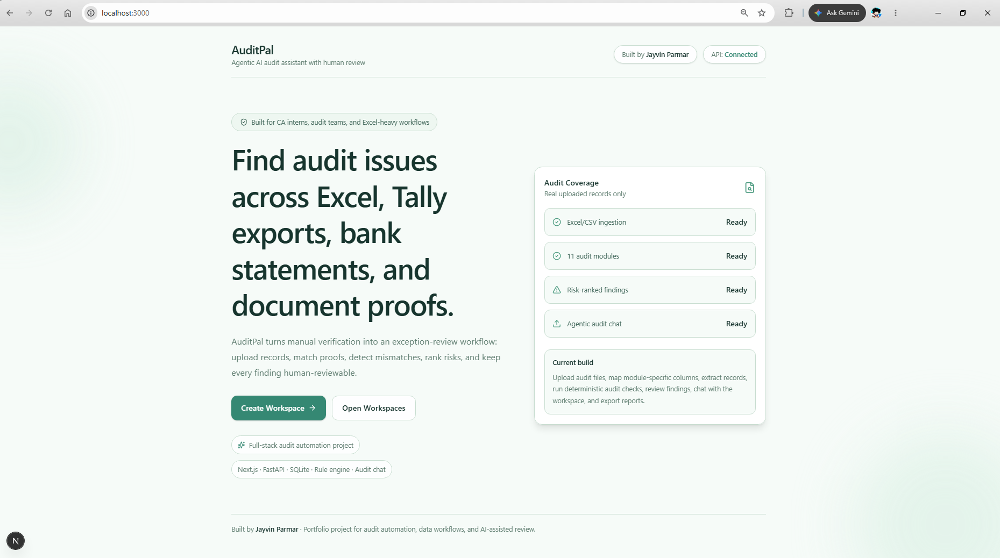

AuditPal starts with a polished landing page showing the product positioning, audit coverage, API status, and project branding.

---

### 2. Workspace Management

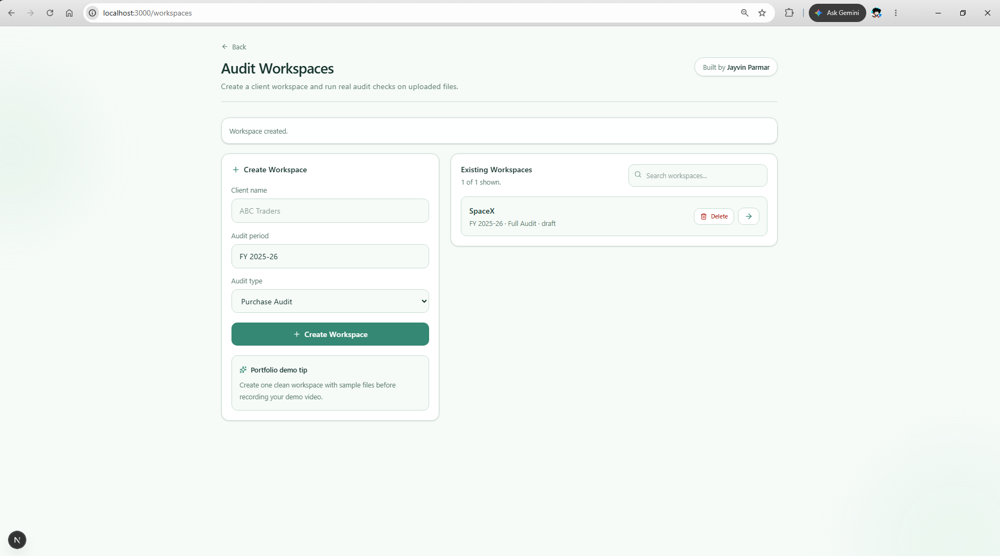

Users can create client audit workspaces, search existing workspaces, open them, or delete test/demo workspaces.

---

### 3. Workspace Overview

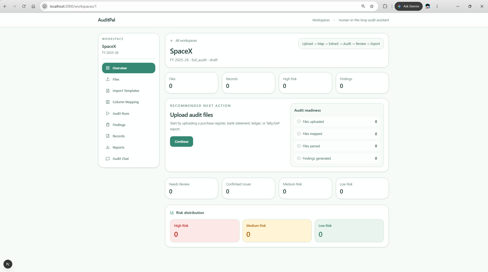

Each workspace has a dashboard showing uploaded files, extracted records, findings, high-risk issues, readiness state, and the recommended next action.

---

### 4. File Upload and File Type Selection

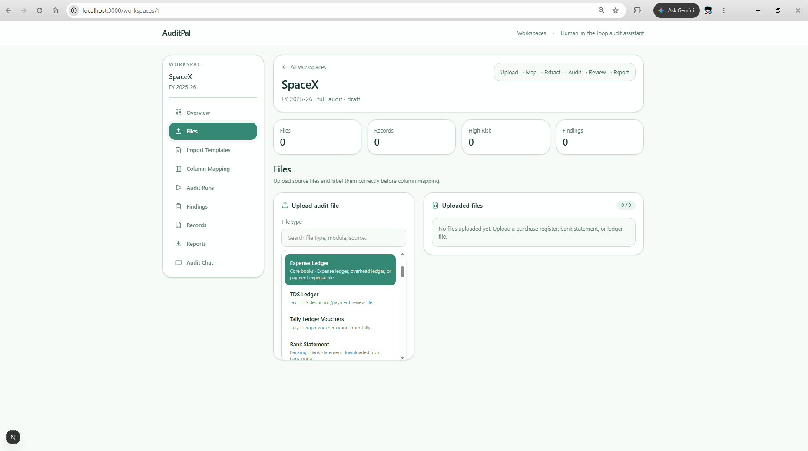

Users can upload CSV/XLSX files and classify them by source type, such as purchase register, sales register, bank statement, GSTR-2B, fixed asset register, Tally export, SAP export, aging report, or OCR/support document extract.

---

### 5. Module-Specific Column Mapping

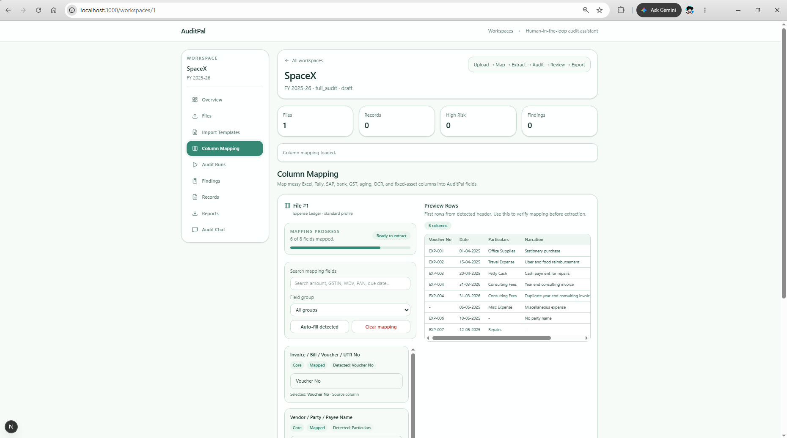

AuditPal supports module-specific mapping fields. For example, fixed asset files can map Asset ID, Asset Cost, Depreciation, WDV, and Asset Status, while GST files can map GSTIN, taxable value, invoice value, IGST, CGST, and SGST.

---

### 6. Mapping Preview Table

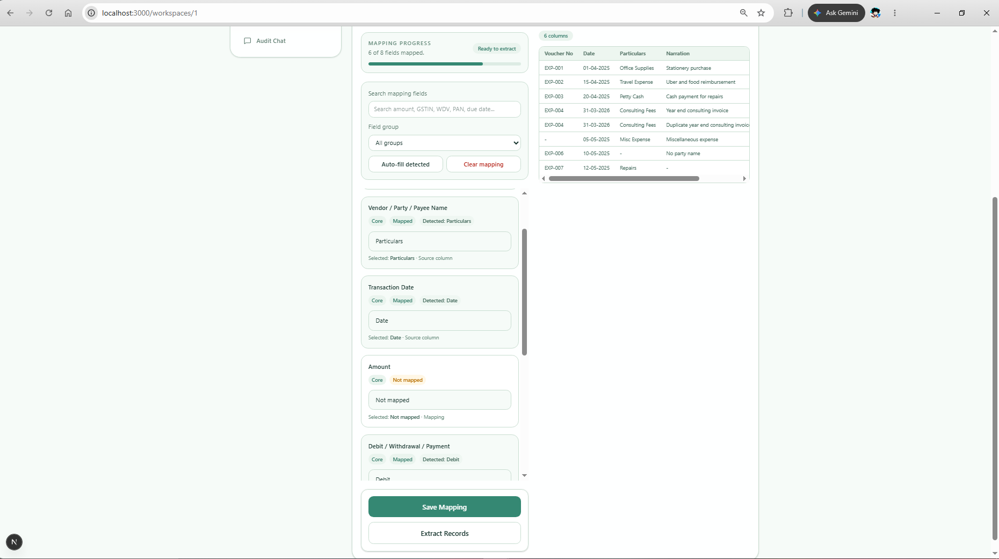

The mapping screen previews uploaded rows so users can verify the source columns before extracting records.

---

### 7. Audit Module Selector

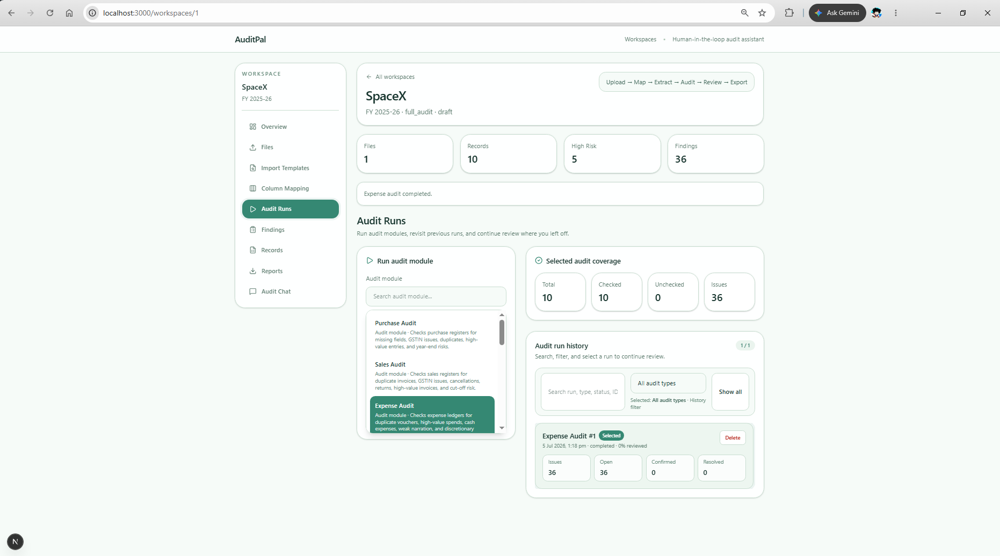

Users can choose audit modules from a searchable selector and run the correct review based on uploaded data.

---

### 8. Audit Run History

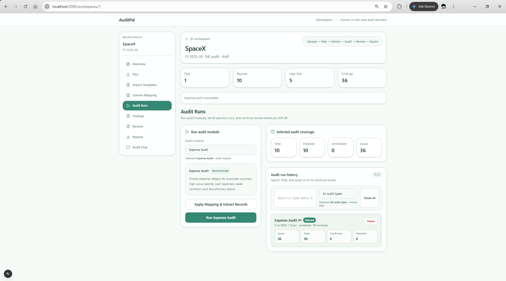

Every audit execution creates an audit run with checked records, issue counts, risk counts, status counts, and historical traceability.

---

### 9. Findings Review

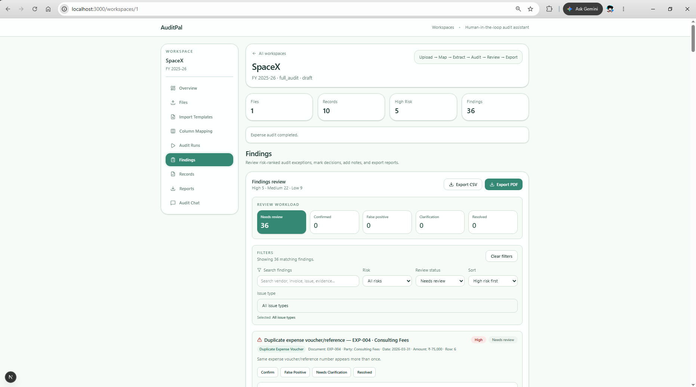

Audit findings are risk-ranked and human-reviewable. Users can review issues, update status, and save reviewer notes.

---

### 10. Findings Search, Sort, and Filters

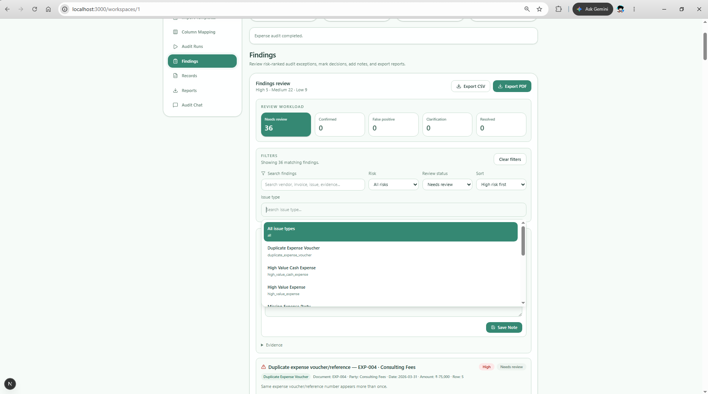

Findings can be searched, sorted, and filtered by risk, issue type, and review status.

---

### 11. Finding Evidence Panel

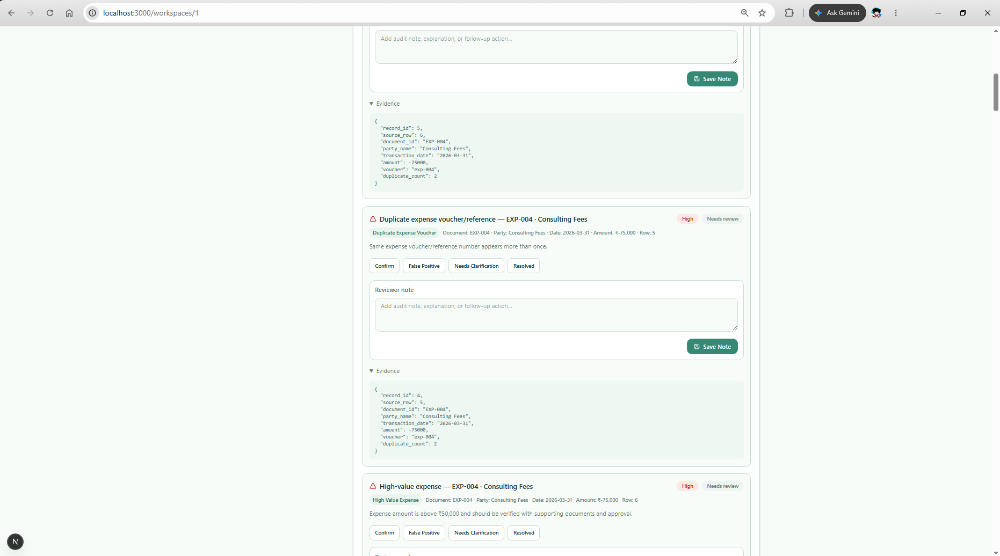

Every finding includes supporting evidence so the auditor can understand why the issue was generated.

---

### 12. Extracted Records Table

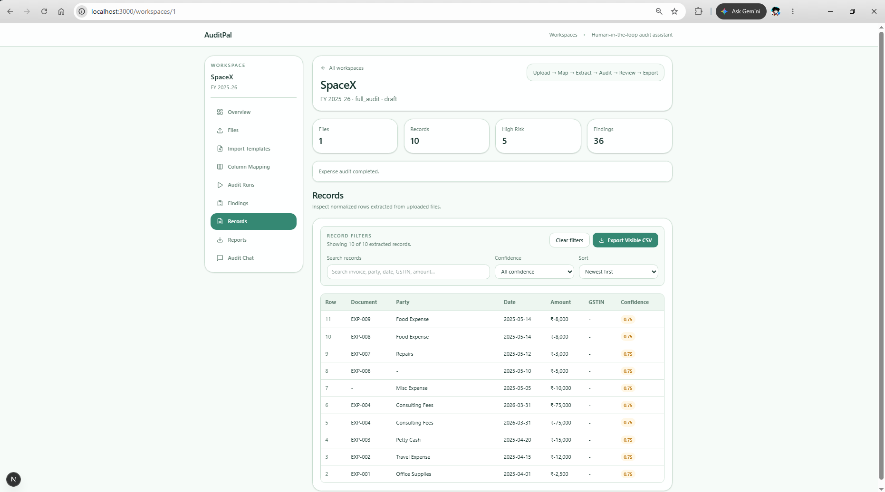

AuditPal stores normalized extracted records and provides search, confidence filtering, sorting, and visible-record export.

---

### 13. Reports Export

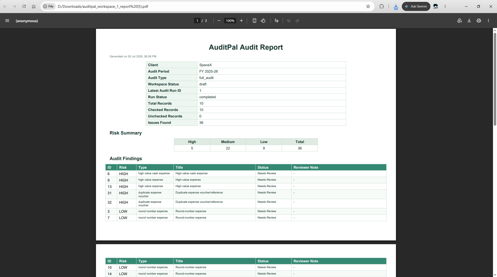

Users can export audit findings as CSV and PDF reports.

---

### 14. Audit Chat Summary

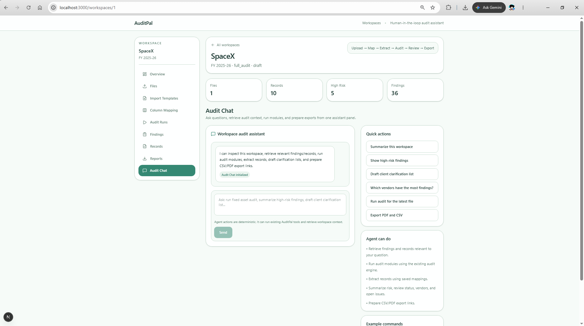

Audit Chat can inspect the workspace and summarize files, records, audit runs, findings, risks, and review status.

---

### 15. Audit Chat Agent Action

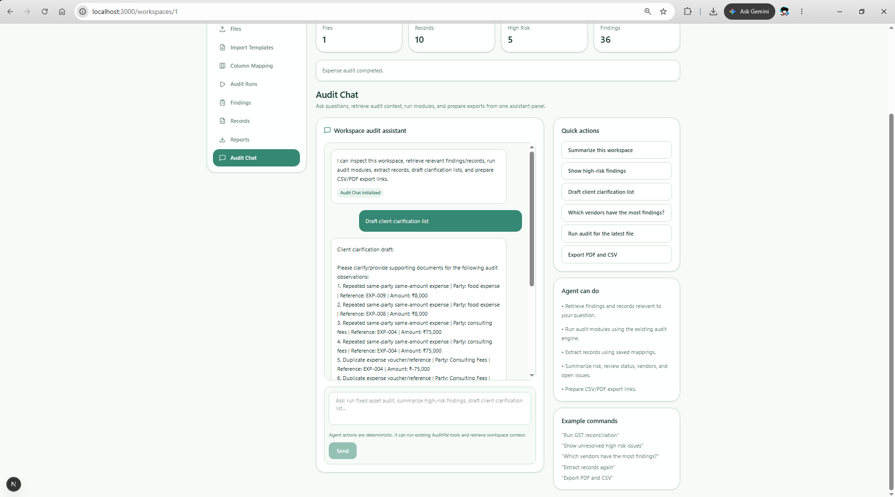

Audit Chat can perform tool-based actions such as drafting client clarification lists, grouping vendors by findings, preparing export links, triggering record extraction, and running audit modules.

---

## Key Features

### Workspace-Based Audit System

Each client audit is isolated inside a workspace. A workspace contains:

- Uploaded files
- Column mappings
- Extracted records
- Audit runs
- Findings
- Reviewer notes
- Reports
- Audit Chat context

This makes the app feel like a real audit workflow product rather than a single-file demo.

---

### File Upload and Classification

AuditPal supports CSV/XLSX uploads for multiple accounting and audit source types.

Supported profiles include:

```txt
purchase_register
tally_purchase_register
generic_sales_register
expense_ledger
tds_ledger
tally_ledger_vouchers
bank_statement
cash_bank_ledger
bank_ledger
tally_bank_book
sap_vendor_line_items
sap_gl_line_items
sap_customer_line_items
gstr_2b
fixed_asset_register
depreciation_schedule
sap_asset_register
tally_fixed_assets
tally_trial_balance
sap_trial_balance
financial_statement
trial_balance
receivables_aging
payables_aging
outstanding_receivables
outstanding_payables
tally_outstanding_receivables
tally_outstanding_payables
sap_customer_open_items
sap_vendor_open_items
support_documents
ocr_extract
document_extract
voucher_support
invoice_ocr
bill_ocr
```

---

### Column Mapping Engine

Real audit files often have inconsistent column names. AuditPal includes a mapping layer that lets users map source columns into normalized audit fields.

Standard fields include:

- Invoice / Bill / Voucher / UTR Number
- Vendor / Party / Payee Name
- Transaction Date
- Amount
- Debit Amount
- Credit Amount
- GSTIN
- Description / Narration

Module-specific fields include:

#### GST

- Supplier GSTIN
- Customer GSTIN
- Taxable Value
- Invoice Value
- IGST
- CGST
- SGST
- Place of Supply
- Supply Type

#### TDS

- PAN
- TDS Amount
- TDS Section
- Payment Nature

#### Fixed Assets

- Asset ID
- Asset Category
- Asset Description
- Asset Cost
- Depreciation
- Depreciation Rate
- WDV / Net Block
- Asset Status

#### Trial Balance

- Ledger Name
- Ledger Group
- Opening Balance
- Debit Balance
- Credit Balance
- Closing Balance

#### Aging

- Invoice Date
- Due Date
- Days Overdue
- Outstanding Amount
- Aging Bucket
- Party Type

#### Document Matching

- OCR Confidence
- Document Type
- Extracted Text
- Support File Name

#### Bank

- Bank Reference / UTR
- Cheque Number
- Value Date

---

## Audit Modules

AuditPal includes **11 audit/review modules**.

| Module | What It Checks |
|---|---|
| Purchase Audit | Missing invoice numbers, missing vendors, invalid GSTINs, duplicate invoices, high-value purchases, round amounts, year-end transactions |
| Sales Audit | Missing sales invoice data, missing customer details, duplicate invoices, high-value sales, cancellations, returns, missing GSTINs |
| Expense Audit | High-value expenses, cash expenses, weak narration, duplicate vouchers, round amounts, year-end expenses, sensitive categories |
| Bank Reconciliation | Bank entries missing in books, book entries missing in bank, duplicate bank transaction patterns |
| GST Reconciliation | Books vs GSTR-2B mismatches, missing invoices, amount mismatches, missing supplier GSTINs, duplicate GST records |
| Ledger Scrutiny | Suspense accounts, manual journal indicators, cash ledger activity, weak narration, loan/advance/deposit movements |
| TDS Review | Possible TDS not deducted, missing PAN, missing TDS section, high-value sensitive payments, duplicate TDS vouchers |
| Fixed Asset Audit | Missing asset IDs, missing categories, high-value additions, depreciation issues, negative WDV, disposals, duplicate asset references |
| Trial Balance Review | Suspense balances, negative cash/bank balances, abnormal debit/credit balances, high-value ledgers, imbalance |
| Aging Review | Old receivables/payables, overdue balances, high-value outstanding amounts, missing due dates, negative outstanding amounts |
| Document Matching | Book entries missing support documents, support documents not booked, amount mismatches, party mismatches, low OCR confidence |

---

## Findings Review Workflow

AuditPal does not treat automated findings as final conclusions. Every finding is human-reviewable.

Finding statuses:

- Needs Review
- Confirmed Issue
- False Positive
- Needs Client Clarification
- Resolved

Users can:

- Search findings
- Filter findings by risk, type, and status
- Sort findings
- Review evidence
- Save reviewer notes
- Update finding status
- Export findings

This makes the project more realistic because audit automation should assist review, not replace professional judgment.

---

## Audit Chat Assistant

AuditPal includes an agentic workspace assistant.

The current Audit Chat is a deterministic tool-based assistant over the workspace database and audit engine. It can retrieve relevant context, summarize audit state, and trigger existing backend actions.

Example prompts:

```txt
Summarize this workspace
Show high-risk findings
Which vendors have the most findings?
Draft client clarification list
Run fixed asset audit
Run GST reconciliation
Export PDF and CSV
Extract records again
```

Audit Chat can:

- Retrieve relevant findings
- Retrieve relevant records
- Summarize workspace risk
- Summarize open review status
- Group findings by vendor/party
- Draft client clarification lists
- Run audit modules
- Trigger record extraction
- Prepare CSV/PDF export links

The current version does not require a paid LLM API, making the local demo reliable and reproducible.

---

## Reports and Exports

AuditPal supports:

- CSV findings export
- PDF audit report export
- Visible records CSV export from the records table
- Export links through Audit Chat

Reports are useful for audit documentation, review handoff, and client clarification workflows.

---

## Tech Stack

### Frontend

- Next.js
- React
- TypeScript
- Tailwind CSS
- Lucide React
- Axios

### Backend

- FastAPI
- Python
- SQLAlchemy
- SQLite
- Pandas
- OpenPyXL
- CSV export
- PDF report generation

### Architecture

```txt
AuditPal/
├── frontend/          # Next.js frontend
├── backend/           # FastAPI backend
├── sample-data/       # Sample audit CSV/XLSX files
├── screenshots/       # README screenshots
├── docs/
└── README.md
```

---

## How It Works

### 1. Create Workspace

The user creates a client audit workspace with client name, audit period, and audit type.

### 2. Upload Audit Files

The user uploads CSV/XLSX files and labels them by file type.

Examples:

- Purchase Register
- Fixed Asset Register
- GSTR-2B
- Bank Statement
- Tally Ledger Vouchers
- SAP Vendor Line Items
- Aging Report
- OCR Extract

### 3. Map Columns

AuditPal detects available columns and lets the user map them into normalized audit fields.

### 4. Extract Records

The backend parses the uploaded file using Pandas/OpenPyXL and stores normalized rows as extracted records.

### 5. Run Audit Module

The selected audit module checks the extracted records using deterministic audit rules.

### 6. Generate Findings

AuditPal stores findings with:

- Finding type
- Risk level
- Title
- Description
- Source record
- Matched record, where applicable
- Evidence
- Review status
- Reviewer note

### 7. Review Findings

The auditor reviews findings, updates their status, saves notes, and inspects evidence.

### 8. Use Audit Chat

Audit Chat can summarize the workspace, retrieve relevant records/findings, draft clarification lists, group vendors, and run audit tools.

### 9. Export Reports

The user exports CSV/PDF reports for audit documentation.

---

## Example Issues AuditPal Can Detect

AuditPal can detect issues such as:

- Missing invoice number
- Missing vendor/customer name
- Missing GSTIN
- Invalid GSTIN format
- Duplicate invoice numbers
- Repeated same-party same-amount transactions
- High-value purchases
- High-value sales
- High-value expenses
- Round-number transactions
- Year-end transactions
- High-value cash expenses
- Weak narration
- Suspense ledger activity
- Manual journal indicators
- Possible TDS not deducted
- Missing PAN for TDS-sensitive payments
- TDS section missing
- Books invoice missing in GSTR-2B
- GSTR-2B invoice missing in books
- GST amount mismatch
- Asset depreciation exceeding cost
- Negative WDV
- Fully depreciated active assets
- Duplicate asset references
- Trial balance imbalance
- Negative cash/bank balance
- Old receivables
- Old payables
- Missing support documents
- Support documents not booked
- Books vs support amount mismatch
- Low OCR confidence support document

---

## Current Limitations

- Document Matching currently works with structured OCR/support document extracts, not direct raw image/PDF OCR.
- The audit engine is deterministic and rule-based.
- Findings are audit exceptions, not final audit opinions.
- Results require human review.
- SQLite is used for local demo storage.
- Report exports are currently workspace-level.
- Authentication and multi-user roles are not implemented yet.

---

## Future Scope

Planned improvements:

### AI and RAG

- Add Gemini/OpenAI-powered intent planning for Audit Chat
- Add natural language audit memos
- Add LLM-generated client query letters
- Add semantic search over supporting documents
- Add retrieval over prior audit runs and review notes

### OCR and Document Intelligence

- Direct PDF/image invoice upload
- OCR extraction for invoices, bills, vouchers, and receipts
- OCR confidence scoring
- Automatic support document classification
- Books vs document matching from raw PDFs/images

### Audit Product Features

- Selected audit-run-specific CSV/PDF exports
- Configurable materiality thresholds
- Custom audit rules per workspace
- Rule severity configuration
- Audit trail for reviewer actions
- Finding assignment and ownership
- Client response tracking

### Platform Features

- User authentication
- Team/organization roles
- Cloud database deployment
- Background job queue for large files
- File storage on cloud object storage
- Dashboard analytics
- Multi-client audit portfolio view

---

## Local Setup

### 1. Clone Repository

```bash
git clone https://github.com/Jayvin21/AuditPal.git
cd AuditPal
```

### 2. Start Backend

```powershell
cd backend
python -m venv .venv
.\.venv\Scripts\activate
pip install -r requirements.txt
uvicorn app.main:app --reload
```

Backend runs at:

```txt
http://localhost:8000
```

API docs:

```txt
http://localhost:8000/docs
```

### 3. Start Frontend

Open another terminal:

```powershell
cd frontend
npm install
npm run dev
```

Frontend runs at:

```txt
http://localhost:3000
```

---

## Demo Workflow

```txt
1. Create a workspace
2. Upload a CSV/XLSX audit file
3. Select the correct file type
4. Open Column Mapping
5. Map source columns to AuditPal fields
6. Extract records
7. Run an audit module
8. Review findings
9. Save reviewer notes/status
10. Ask Audit Chat for a summary or clarification list
11. Export CSV/PDF reports
```

---

## Portfolio Positioning

AuditPal demonstrates:

- Full-stack product development
- Domain-specific workflow design
- Audit automation
- Data extraction and normalization
- Rule-based detection systems
- RAG-style workspace retrieval
- Agentic assistant workflows
- Human-in-the-loop review
- Report generation
- Realistic business process automation

This project is built to show practical engineering beyond a basic CRUD app or chatbot demo.

---

## Author

**Jayvin Parmar**

Computer Engineering graduate building full-stack AI, automation, RAG, and data workflow systems.

GitHub: [Jayvin21](https://github.com/Jayvin21)

---

## License

Copyright © 2026 Jayvin Parmar. All rights reserved.

This project is shared publicly for portfolio and demonstration purposes only.
No permission is granted to copy, modify, distribute, sublicense, or use this code or product design for commercial purposes without written consent.
